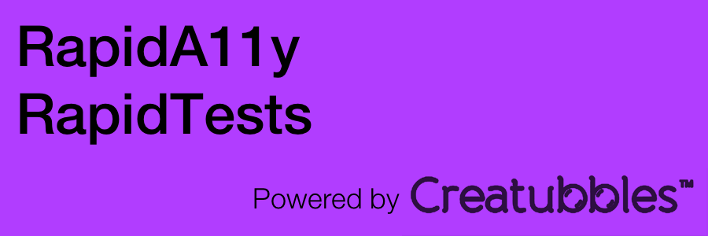

[](https://cocoapods.org/pods/RapidTests)
[](https://github.com/creatubbles/Rapid/blob/master/LICENSE.md)
[](https://cocoapods.org/pods/RapidTests)

Rapid is a UI test development framework for Swift (and Objective-C soon!).
Inspired heavily by [Quick](https://github.com/Quick/quick), and currently using both [Quick](https://github.com/Quick/quick) and [Nimble](https://github.com/Quick/Nimble) as dependencies. 

## Installation
##### Cocoapods

Sample `Podfile`:

```
platform :ios, '9.0'
use_frameworks!

def test_pods
    # define test pod imports
    # Rapid uses both Quick and Nimble
    pod 'Quick', '~> 0.10.0'
    pod 'Nimble', '~> 5.0.0'
    pod 'RapidTests', '1.0.1'
end

abstract_target 'Common' do
    # other common target pods here   
    pod 'RapidA11y', '1.0.1'

    # app target which picks up RapidA11y pod and any other common pods
    target 'Example' do 
    end

    # test target gets RapidTests pod added (+ Quick/Nimble)
    # it still does get RapidA11y and common pods as well. 
    target 'ExampleUITests' do
        test_pods 
    end
end

```

With the `RapidA11y` (A11y is for Accessibility, A-(11 letters)-y) pod being needed for common app targets (whichever ones will have access to elements that need to be made visible to the testing harness)

With the `RapidTests` pod being needed only in test targets (mainly the UI test target, to be specific).

Once `Podfile` setup for your project, run `$ pod install` in the directory of your Podfile ([Troubleshooting help for this step from CocoaPods](https://guides.cocoapods.org/using/troubleshooting.html))

## Setup
##### Step 1/6: RapidA11y Setup - Core protocol

First step is to set up client side (within app target, as an A11y helper of some kind (*Note*: full Accessibility and VoiceOver solutions can be easily implemented off of this RapidA11y pod alone)). There is 1 core protocol, which defines a loose way to represent elements for the accessibility system (and can be customized fully).


```
public protocol A11yViewFactoryProtocol {
    associatedtype Control: StringRawRepresentable
    associatedtype View: StringRawRepresentable

    func view(for view: View) -> A11yView<Control, View>?
}
```

A `Control` represents any `UIControl` `UIKit` type element (not necessarily just `UIControl`, since `UIBarButtonItem` is not technically a `UIControl`, for example...). These are later in the `RapidTests` pod associated with `XCUIElement`s of specific types, such as: `button`, `collectionView`, `textField`, `image`, etc...

In the application target Accessibility implementation, it is often best to have some kind of `A11yControlName` enum which represents a "high level" list of control types you have (in more detail than just buttons, images, etc). For example, an application with a sign in and sign up feature would likely have a need for controls named for the specific purpose of passwords and/or usernames, among other things. A first `Control` enum is best used to represent this (and should be `StringRawRepresentable`)

A `View` represents any logical visible component that will either be used for accessibility only or will be tested as well. These are used to group `Control` elements together into logical units, and a `View` is characterized by an ORDERED ARRAY of `Control` elements. This order is specific to how the Accessibility engine on iOS behaves by default in VoiceOver: elements are "cycled" through from **top left**, *left to right*, followed by *top to bottom*, ending in **bottom right**. With this in mind, a `View` is expected to have an explicit `Control` array defined by the order of "origin" points of all subviews (ie: controls) in this view. 

##### Step 2/6: RapidA11y Setup - Name enumerations

With an enum in hand for both of these things (let's call them `A11yControlName` and `A11yViewName`), you can then *`typealias`* an `A11yView` from the `RapidA11y` framework

```
typealias ExampleRapidA11yView = A11yView<A11yControlName, A11yViewName>
```

##### Step 3/6: RapidA11y Setup - View configuration typealiasing and usage

There is a helper typealias also setup to help configure the views: 

```
public typealias A11yViewConfig<Control> = [A11yControlType: [Control]]
```

This `A11yViewConfig` is then able to be used in an application target *`typelias`*

```
typealias ExampleRapidA11yViewConfig = A11yViewConfig<A11yControlName>
```


##### Step 4/6: RapidA11y Setup - A11yView demonstration for configuration
```
func configureDemoView() -> ExampleRapidA11yView {
        var viewConfig = ExampleRapidA11yViewConfig()
        viewConfig[A11yControlType.button] = [A11yControlName.bigRedDemoButton]
        return A11yView(viewName: .demoView, config: viewConfig)
}
```
Notes:
- `A11yControlType` enum provided by pod with most common `UIControl`s and *generic* controls for anything else.
- Example Definition of `A11yControlName`: 
```
enum A11yControlName: String, StringRawRepresentable {
  case bigRedDemoButton
}
```
- Example Definition of `A11yViewName`:
```
enum A11yViewName: String, StringRawRepresentable {
  case demoView
}
```

##### Step 5/6: Rapid Setup - Add Accessibility to a view controller

For a given view controller, now, with a defined [*view hierarchy*](https://developer.apple.com/library/content/documentation/General/Conceptual/Devpedia-CocoaApp/View%20Hierarchy.html) by the `Control` and `View` enums, we can accessibilize a view controller with just:

```
extension DemoViewController: A11yIdentifiable {
    public func setupA11y() {
        Rapid.shared.a11y().addA11yIdentifiersForControls([demoBigRedButton], inView: view, withA11yViewName: A11yViewName.demoView, forFactory: A11yViewFactory.shared)
    }
}
```
Note: `A11yIdentifiable` is just a small protocol to ensure `setupA11y()` method is implemented, but remember to call it in `viewDidLoad` after outlets are all initialized. 
```
protocol A11yIdentifiable {
    func setupA11y()
}
```

##### Step 6/6: RapidTests Setup - Coming soon

Under construction, more coming soon!


## License
#### MIT License

Copyright 2017 Creatubbles

Permission is hereby granted, free of charge, to any person obtaining a copy of this software and associated documentation files (the "Software"), to deal in the Software without restriction, including without limitation the rights to use, copy, modify, merge, publish, distribute, sublicense, and/or sell copies of the Software, and to permit persons to whom the Software is furnished to do so, subject to the following conditions:

The above copyright notice and this permission notice shall be included in all copies or substantial portions of the Software.

THE SOFTWARE IS PROVIDED "AS IS", WITHOUT WARRANTY OF ANY KIND, EXPRESS OR IMPLIED, INCLUDING BUT NOT LIMITED TO THE WARRANTIES OF MERCHANTABILITY, FITNESS FOR A PARTICULAR PURPOSE AND NONINFRINGEMENT. IN NO EVENT SHALL THE AUTHORS OR COPYRIGHT HOLDERS BE LIABLE FOR ANY CLAIM, DAMAGES OR OTHER LIABILITY, WHETHER IN AN ACTION OF CONTRACT, TORT OR OTHERWISE, ARISING FROM, OUT OF OR IN CONNECTION WITH THE SOFTWARE OR THE USE OR OTHER DEALINGS IN THE SOFTWARE.

See also the [`LICENSE`](LICENSE.md) file for details.